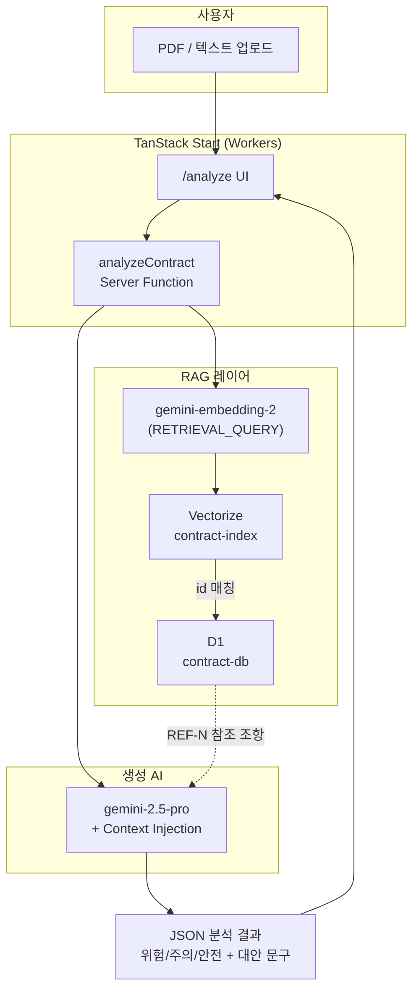

# 안심계약 AI (Easy Legal Guard)
  
프리랜서·소상공인을 위한 **AI 계약서 리스크 검토** 서비스 MVP입니다.  
PDF 계약서를 업로드하면 독소 조항을 탐지하고, 표준약관에 기반한 **대안 문구**를 제안합니다.

> 상세 요구사항: [`cursorrules/PRD.md`](cursorrules/PRD.md)  
> 개발 체크리스트: [`cursorrules/ckecklist.md`](cursorrules/ckecklist.md)  
> 코딩 규칙: [`cursorrules/cursor.md`](cursorrules/cursor.md)

---

## 목차

1. [한눈에 보기](#한눈에-보기)
2. [기술 스택](#기술-스택)
3. [시스템 아키텍처](#시스템-아키텍처)
4. [데이터 파이프라인 (0단계)](#데이터-파이프라인-0단계)
5. [RAG + 분석 흐름 (2~3단계)](#rag--분석-흐름-23단계)
6. [프로젝트 구조](#프로젝트-구조)
7. [환경 변수](#환경-변수)
8. [로컬 개발](#로컬-개발)
9. [스크립트 가이드](#스크립트-가이드)
10. [Cloudflare 배포](#cloudflare-배포)
11. [트러블슈팅](#트러블슈팅)
12. [진행 현황 & 다음 단계](#진행-현황--다음-단계)

---

## 한눈에 보기

| 항목 | 내용 |
|------|------|
| **서비스명** | 안심계약 AI (가칭) |
| **저장소** | [github.com/namgoygoy/easy-legal-guard](https://github.com/namgoygoy/easy-legal-guard) |
| **MVP 데이터** | AI-Hub 라벨링 데이터 기반 **2,500건** (6개 계약 유형) |
| **전체 전처리 데이터** | `standard_clauses.jsonl` **131,706행** (확장용) |
| **임베딩 모델** | `gemini-embedding-2` (768차원, `output_dimensionality=768`) |
| **분석 모델** | `gemini-2.5-pro` (Gemini API 직접 호출) |
| **지식 베이스** | Cloudflare **D1** (원문) + **Vectorize** (벡터) |
---

## 기술 스택

| 영역 | 기술 |
|------|------|
| Frontend | React 19, TanStack Start/Router, Tailwind CSS, shadcn/ui |
| Backend | TanStack Start Server Functions, Cloudflare Workers |
| AI | Google Gemini (`gemini-embedding-2`, `gemini-2.5-pro`) |
| PDF | `pdfjs-dist` (브라우저 클라이언트 추출) |
| DB / 검색 | Cloudflare D1 + Vectorize |
| 배포 | Cloudflare Workers (`wrangler`) |
| 데이터 전처리 | Python 3 (`scripts/`) |

> 초기 PRD는 Python/FastAPI 백엔드를 가정했으나, MVP는 **TanStack Start 풀스택 + Workers** 단일 앱으로 구현했습니다.

---

## 시스템 아키텍처



**핵심 설계**

- **Vectorize**: 유사 조항 검색 (빠른 ANN 검색)
- **D1**: 검색된 ID의 **원문·라벨·조항번호** 저장 (할루시네이션 방지용 근거)
- **Context-Injection**: 검색 결과를 `SYSTEM_PROMPT`에 `[REF-1]` 형식으로 주입
- **Few-shot**: 검색된 표준 조항으로 위험/주의/안전 패턴 가이드 생성

---

## 데이터 파이프라인 (0단계)

AI-Hub **계약 법률 문서** 라벨링 데이터(`TL_*` / `VL_*` zip)를 전처리해 지식 베이스를 구축합니다.

```
data/Training|Validation/02.라벨링데이터/*.zip
        │
        ▼  preprocess_aihub.py (zip 내 JSON 압축 해제 없이 읽기)
data/processed/standard_clauses.jsonl   ← 131,706행
        │
        ▼  create_small_corpus.py (MVP 샘플링)
data/processed/standard_clauses_small.jsonl   ← 2,500행
        │
        ▼  generate_embeddings.py (Gemini 임베딩)
data/processed/upload_small/
  ├── inserts/inserts_*.sql    → D1 INSERT
  └── vectors/vectors_*.ndjson → Vectorize INSERT
```

### MVP 소코퍼스 구성 (2,500건)

| service_type_id | 설명 | 샘플 수 |
|-----------------|------|--------|
| `dev` | IT/개발 용역 | 900 |
| `nda` | 비밀유지 | 450 |
| `lease` | 상가 임대차 | 400 |
| `design` | 디자인 용역 | 350 |
| `franchise` | 가맹/대리점 | 250 |
| `translation` | 저작권/콘텐츠 | 150 |

`etc` 카테고리는 MVP에서 **제외**했습니다.

### JSONL 레코드 스키마 (요약)

```json
{
  "contract_type": "개발계약서",
  "article_no": 3,
  "labels": ["용역 계약 기간"],
  "content": "제3조 【개발기간】 ...",
  "service_type_id": "dev",
  "service_type_label": "IT/개발 용역",
  "split": "Training"
}
```

---

## RAG + 분석 흐름 (2~3단계)

사용자가 계약서를 제출하면 `src/lib/analyze.functions.ts`에서 다음을 수행합니다.

```
1. 계약 유형 → service_type_id 매핑 (contract-types.ts)
2. 계약서 앞부분 텍스트 → gemini-embedding-2 (RETRIEVAL_QUERY)
3. Vectorize.query(topK=8, service_type 필터)
4. D1에서 id로 원문 조회 (rag.ts)
5. 참조 조항 + Few-shot 블록을 SYSTEM_PROMPT에 주입
6. gemini-2.5-pro로 분석 (function calling → JSON)
7. UI에 결과 렌더링 (/analyze)
```

### 할루시네이션 방지 규칙

- `basis` 필드는 검색된 **`[REF-N]`** 만 인용
- 검색 조항에 없는 **법조문 번호·조항 번호를 생성하지 않음**
- RAG 실패 시 일반 원칙으로만 분석 (로그: `[RAG] 검색 실패`)

### 관련 소스 파일

| 파일 | 역할 |
|------|------|
| `src/lib/rag.ts` | Vectorize + D1 검색, Context/Few-shot 빌드 |
| `src/lib/gemini-embed.ts` | 쿼리 임베딩 API |
| `src/lib/gemini-analyze.ts` | Gemini 분석 API |
| `src/lib/analyze.functions.ts` | 서버 함수 진입점 |
| `src/routes/analyze.tsx` | 업로드·결과 UI |

---

## 프로젝트 구조

```
legal/
├── README.md                 ← 이 문서
├── cursorrules/              PRD, 체크리스트, 코딩 규칙
├── data/
│   ├── Training|Validation/  AI-Hub 원본 zip (gitignore)
│   └── processed/            JSONL, upload 산출물
├── scripts/                  Python 전처리·업로드 도구
│   ├── preprocess_aihub.py
│   ├── create_small_corpus.py
│   ├── generate_embeddings.py
│   ├── generate_d1_inserts.py
│   ├── test_rag_local.py
│   └── migrations/001_standard_clauses.sql
├── src/
│   ├── lib/                  RAG, Gemini, PDF, 분석 로직
│   ├── routes/               /, /analyze
│   └── server.ts             Workers 엔트리
├── wrangler.jsonc            D1·Vectorize 바인딩
└── worker-configuration.d.ts wrangler types (npm run cf-typegen)
```

---

## 환경 변수

| 변수 | 필수 | 용도 |
|------|------|------|
| `GEMINI_API_KEY` | **권장** | 임베딩 + 분석 + RAG (Google AI Studio) |
| `LOVABLE_API_KEY` | 선택 | Lovable Gateway 폴백 (분석만) |

로컬: 프로젝트 루트 `.env`  
배포: `wrangler secret put GEMINI_API_KEY`

```bash
# .env 예시
GEMINI_API_KEY=your-key-here
```

> API 키는 Git에 커밋하지 마세요.

---

## 로컬 개발

### 1. 의존성

```bash
npm install
```

### 2. Python (데이터 스크립트용, 선택)

```bash
python3 -m venv scripts/.venv
source scripts/.venv/bin/activate
pip install -r scripts/requirements.txt
```

### 3. 개발 서버

```bash
npm run dev
```

- 홈: http://localhost:5173/
- 분석: http://localhost:5173/analyze

> RAG는 **Cloudflare 바인딩**이 필요합니다. `wrangler.jsonc`의 `remote: true` 설정으로 로컬 dev에서 원격 D1/Vectorize에 접근합니다. 바인딩이 없으면 RAG 없이 기본 프롬프트만으로 분석합니다.

### 4. 타입 생성

```bash
npm run cf-typegen
```

---

## 스크립트 가이드

| 스크립트 | 설명 |
|----------|------|
| `preprocess_aihub.py` | zip → `standard_clauses.jsonl` |
| `create_small_corpus.py` | 전체 JSONL → MVP 2,500건 |
| `generate_embeddings.py` | JSONL → D1 SQL + Vectorize NDJSON |
| `generate_d1_inserts.py` | **임베딩 없이** SQL만 재생성 (`SQLITE_TOOBIG` 대응) |
| `list_embedding_models.py` | 사용 가능한 Gemini 임베딩 모델 목록 |
| `test_rag_local.py` | 로컬 NDJSON + JSONL 유사도 검색 테스트 |
| `upload_to_cloudflare.sh` | D1 + Vectorize 일괄 업로드 |

### MVP 데이터 처음부터 만들기

```bash
# 1. 전처리 (zip이 data/ 아래 있어야 함)
python scripts/preprocess_aihub.py

# 2. MVP 소코퍼스
python scripts/create_small_corpus.py

# 3. 임베딩 + 업로드 파일 생성 (수십 분~, API 비용 발생)
export GEMINI_API_KEY="..."
python scripts/generate_embeddings.py \
  --input data/processed/standard_clauses_small.jsonl \
  --output data/processed/upload_small

# 4. Cloudflare 업로드
bash scripts/upload_to_cloudflare.sh data/processed/upload_small
```

### RAG 로컬 테스트 (배포 전)

```bash
python scripts/test_rag_local.py "지식재산권이 발주자에게 귀속된다"
python scripts/test_rag_local.py --service-type dev "개발비 지급 시기"
```

---

## Cloudflare 배포

### 리소스

| 리소스 | 이름 | 바인딩 |
|--------|------|--------|
| D1 | `contract-db` | `contract_db` |
| Vectorize | `contract-index` | `VECTORIZE` (768 dimensions) |

### 스키마 (최초 1회)

```bash
wrangler d1 execute contract-db --remote \
  --file=scripts/migrations/001_standard_clauses.sql
```

### 데이터 업로드

```bash
bash scripts/upload_to_cloudflare.sh data/processed/upload_small
```

상세: [`data/processed/upload_small/UPLOAD.md`](data/processed/upload_small/UPLOAD.md)

### 앱 배포

```bash
npm run build
wrangler deploy
```

---

## 트러블슈팅

### `SQLITE_TOOBIG` (D1 INSERT 실패)

**원인:** 한 SQL 파일에 수백 행의 긴 `INSERT`가 묶여 SQLite 문장 크기 초과.

**해결:**

```bash
python scripts/generate_d1_inserts.py \
  --input data/processed/standard_clauses_small.jsonl \
  --output data/processed/upload_small
```

- 파일당 **15행**, 행마다 **개별 INSERT** 문으로 생성됩니다.

### `임베딩 수(1) ≠ 텍스트 수(10)`

**원인:** `gemini-embedding-2`는 문자열 배열을 한 번에 넘기면 벡터 1개만 반환하는 경우가 있음.

**해결:** `generate_embeddings.py`에서 **건별 임베딩** (`EMBED_ONE_REQUEST_PER_TEXT = True`).

### RAG 검색 0건

- `contract-index`에 벡터가 업로드되었는지 확인
- `service_type_id` 필터와 업로드 metadata 일치 여부 확인
- dev 로그: `[RAG] 검색된 표준 조항: N건`

### 임베딩 모델 목록이 안 보일 때

API는 `v1beta` 사용:

```bash
python scripts/list_embedding_models.py
```

---

## 진행 현황 & 다음 단계

### 완료

- [x] AI-Hub 전처리 및 MVP 2,500건 코퍼스
- [x] D1 + Vectorize 업로드
- [x] RAG 검색 + Context-Injection + Few-shot
- [x] Gemini API 직접 연동 (`GEMINI_API_KEY`)
- [x] 분석 UI (업로드, 리스크 대시보드, Side-by-Side)

### 진행 예정

- [ ] PDF 스캔본/암호화 PDF 예외 처리
- [ ] 프로덕션 배포 URL·모니터링
- [ ] 전체 13만 건 확장 (비용·Batch API 검토)
- [ ] 프롬프트·RAG 품질 A/B 테스트

---

## 팀 온보딩 체크리스트

1. [ ] 저장소 clone 및 `npm install`
2. [ ] `.env`에 `GEMINI_API_KEY` 설정
3. [ ] `cursorrules/PRD.md` 읽기
4. [ ] `npm run dev` → `/analyze`에서 샘플 PDF 테스트
5. [ ] (데이터 담당) `scripts/` README 흐름으로 upload_small 재현
6. [ ] (인프라) Cloudflare 대시보드에서 D1·Vectorize 데이터 확인

질문·이슈는 GitHub Issues 또는 팀 채널로 공유해 주세요.


